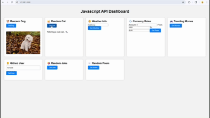

Absolutely! Here's a polished **README** for your API Dashboard project that you can copy to GitHub. I’ve written it so it’s clear, professional, and easy to follow:

---

# JavaScript API Dashboard 🌐

A dynamic dashboard built with **HTML, CSS, and JavaScript** that interacts with multiple APIs to fetch data like dogs, cats, weather, movies, GitHub users, jokes, and poems. Perfect for learning how to work with APIs and async JavaScript.

## Features

* 🐶 Fetch random dog images from [Dog CEO API](https://dog.ceo/dog-api/)
* 🐱 Fetch random cat images from [The Cat API](https://thecatapi.com/)
* ☀️ Get current weather by city using [Open-Meteo](https://open-meteo.com/)
* 💱 Convert currencies with [Frankfurter API](https://www.frankfurter.app/)
* 🎥 Display trending movies using [TMDb API](https://www.themoviedb.org/)
* 🧑‍💻 Search GitHub user profiles via [GitHub API](https://docs.github.com/en/rest)
* 🤣 Get random jokes from [Official Joke API](https://github.com/15Dkatz/official_joke_api)
* 💬 Fetch random poems from [PoetryDB](https://poetrydb.org/)

## Demo

 *(Optional: add a screenshot of your app)*

## Installation

1. **Clone the repository**

```bash
git clone https://github.com/yourusername/api-dashboard.git
cd api-dashboard
```

2. **Install dependencies**

```bash
npm init -y

npm install express node-fetch dotenv cors
```

3. **Set up environment variables**

Create a `.env` file in the root:

```env
TMDB_API_KEY=your_tmdb_api_key_here
```

4. **Run the server**

```bash
node server.js
```

5. **Open the app**

Navigate to [http://127.0.0.1:3000](http://127.0.0.1:3000) in your browser.

---

## Usage

1. Click **Get Dog** or **Get Cat** to fetch a random image.
2. Enter a city and click **Get Weather** to see current weather.
3. Enter amount and currency codes for **Currency Converter**.
4. Click **Get Movies** to see trending movies.
5. Enter a GitHub username to view the profile.
6. Click **Get Joke** or **Get Poem** for some fun content.

---

## Tech Stack

* **Frontend:** HTML, CSS, JavaScript
* **Backend:** Node.js, Express
* **APIs:** Dog CEO, The Cat API, Open-Meteo, Frankfurter, TMDB, GitHub, Official Joke API, PoetryDB

---

## Demo




---

## Notes

* Make sure to use **`localhost` consistently** in both frontend fetch calls and server URL to avoid **CORS issues**.
* For TMDb API, you need a valid API key.
* Some APIs may have rate limits.


